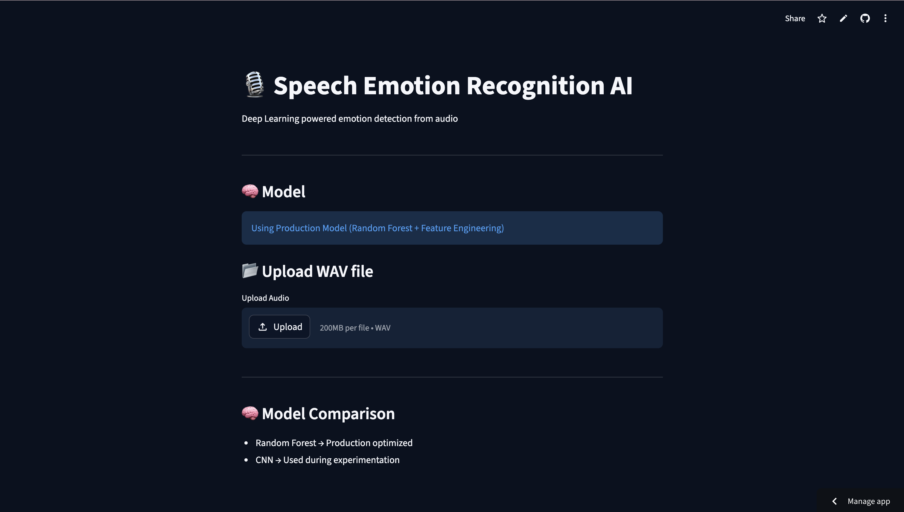
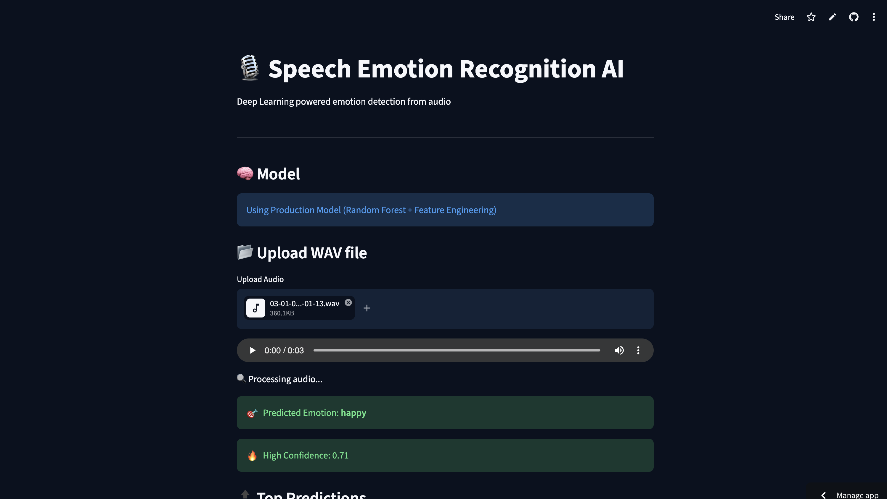
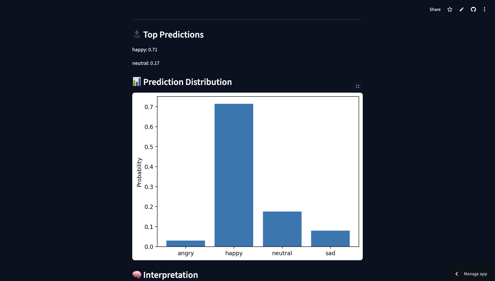

# 🎙️ Speech Emotion Recognition AI

A Deep Learning-powered web application that detects human emotions from speech using audio signals.

🔗 **Live Demo:**
https://speech-emotion-recognition-ai-r5psldx4tsgjj5hupr3wkz.streamlit.app/

---

## 🚀 Features

* 🎧 Upload WAV audio files
* 🧠 Emotion prediction using Machine Learning
* 📊 Confidence score + probability distribution
* 📈 Visualization of prediction results
* ⚡ Real-time inference using Streamlit UI

---

## 🧠 Models Used

| Model               | Description             | Status             |
| ------------------- | ----------------------- | ------------------ |
| Random Forest       | Feature-based ML model  | ✅ Production Model |
| CNN (Deep Learning) | Spectrogram-based model | 🔬 Experimental    |

---

## 🏗️ Tech Stack

* Python
* Streamlit
* Scikit-learn
* TensorFlow / Keras
* Librosa (audio processing)
* Matplotlib

---

## 📂 Project Structure

```
speech-emotion-recognition-ai/
│
├── src/                # Core ML logic
├── models/             # Trained models
├── data/               # Dataset (not uploaded)
├── outputs/graphs/     # Visual outputs
├── docs/screenshots/   # UI screenshots
│
├── streamlit_app.py    # Main UI app
├── run.py              # One-click run script
├── requirements.txt
└── README.md
```

---

## 📸 Screenshots

### 🏠 Homepage



### 📂 Upload & Prediction



### 📊 Prediction Graph



---

## ⚙️ Installation & Run

### 1️⃣ Clone repository

```
git clone https://github.com/kritika038/speech-emotion-recognition-ai.git
cd speech-emotion-recognition-ai
```

### 2️⃣ Install dependencies

```
pip install -r requirements.txt
```

### 3️⃣ Run application

```
streamlit run streamlit_app.py
```

---

## 🎯 Output Example

* Predicted Emotion: **Happy**
* Confidence: **0.71**
* Includes probability distribution across emotions

---

## 📌 Future Improvements

* 🎙️ Real-time microphone input
* 🤖 Transformer-based models (Wav2Vec)
* ☁️ API deployment (FastAPI)
* 📱 Mobile-friendly UI

---

## 👩‍💻 Author

**Kritika**

---

## ⭐ If you like this project, give it a star!
