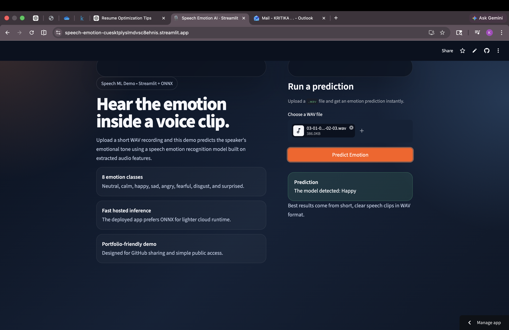
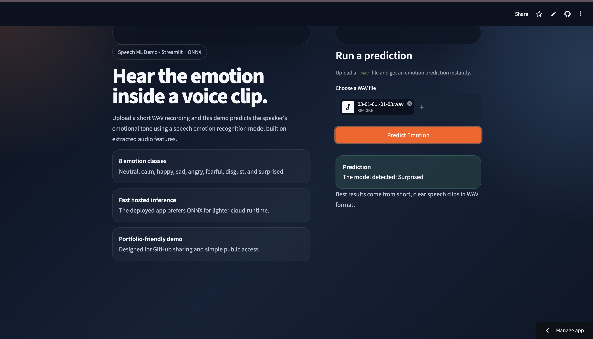

# 🎙️ Speech AI System using PyTorch

Built a real-time Speech Emotion Detection system using PyTorch, achieving **76% accuracy** on the RAVDESS dataset. The system converts raw audio into Mel Spectrograms, trains a custom CNN model, and supports optimized inference via ONNX with a deployed browser-based demo.

- Trained a custom CNN model from scratch using PyTorch for speech emotion classification
- Achieved **76% accuracy** on the RAVDESS dataset
- Exported the model to ONNX for optimized inference and deployment readiness

This project demonstrates a production-style speech AI pipeline involving feature extraction, deep learning model training, optimization, and deployment.

## 🧠 Problem Statement

Human speech carries emotional cues such as tone, pitch, and intensity. This project focuses on classifying emotions from speech signals, which is useful for improving human-AI communication systems such as conversational agents, voice assistants, and adaptive audio interfaces.

## ⚙️ System Pipeline

```text
Audio (.wav)
→ Feature Extraction (Mel Spectrogram using librosa)
→ Deep Learning Model (Custom CNN in PyTorch)
→ Emotion Classification
→ ONNX Export for optimized inference
→ Streamlit Web App for real-time prediction
```

## 🏗️ Model Architecture

- Framework: PyTorch
- Input: `128 x 128` Mel Spectrogram
- Architecture:
  - 3 Convolutional Layers
  - ReLU Activations
  - MaxPooling Layers
  - Fully Connected Layers
- Loss Function: `CrossEntropyLoss`
- Optimizer: `Adam`
- Epochs: `10`

## 📊 Results

- Training loss reduced from approximately `348` to `66`
- Achieved **76% accuracy** on the evaluation split
- Model successfully captures emotional patterns in speech across 8 emotion classes

## ⚡ Optimization

The trained PyTorch model was exported to ONNX format for more efficient inference and easier deployment in lightweight environments.

## 🌐 Deployment

The project includes a public Streamlit web interface that allows users to upload WAV audio files and receive real-time emotion predictions in the browser.

Live demo:

[Open the deployed app](https://speech-emotion-cuesktplyslmdvsc8ehnis.streamlit.app/)

## 📸 Demo

### Upload UI


### Prediction Output



### Additional Prediction Example



## 🔮 Future Work

- Real-time streaming audio emotion detection
- Accent normalization and speech transformation
- Integration with conversational AI systems

## 🧰 Tech Stack

- Python
- PyTorch
- Librosa
- NumPy
- ONNX Runtime
- Streamlit

## ▶️ How to Run

Install dependencies:

```bash
pip install -r requirements.txt
```

Run the deployed-app version locally:

```bash
streamlit run streamlit_app.py
```

To retrain the model locally:

```bash
pip install -r requirements-train.txt
python train.py
```

## 📁 Project Structure

```text
speech-emotion/
├── audio_utils.py
├── dataset.py
├── docs/
│   └── screenshots/
├── emotion_model.pth
├── export_onnx.py
├── inference.py
├── model.onnx
├── model.onnx.data
├── model.py
├── predict.py
├── requirements.txt
├── requirements-train.txt
├── streamlit_app.py
└── train.py
```
